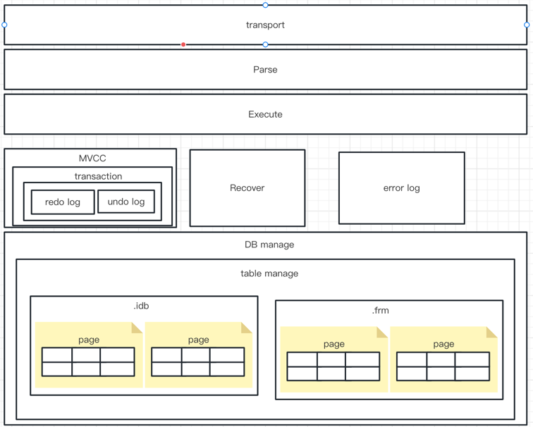

# MyLearnDb
### 学习数据库原理的项目
- 1、写这个项目的是为学习数据库的原理
- 2、项目只完成demo版本，达到学习的目的即可，很多细节是没办法考虑的。
- 3、暂时想要达到的效果如下

### 要实现的功能
- 1、创建数据库、创建表
- 2、增删改查（先单表）
- 3、主键索引
- 4、MVCC
- 5、事务
- 6、数据库异常恢复

### 支持的类型
- boolean short byte int long double string bigDecimal 
- 时间用long类型表示

### 问题与限制 
- 1、最大行长度为4GB
- 2、内存处理的不够好，加载页的时候会多次复制内容，会异常内存占用很高，不过对于学习来说也没什么太大的问题。

### 当前的设计如下

## 后续需要补充 各包的作用，依赖说明等。

### 加油~~~
